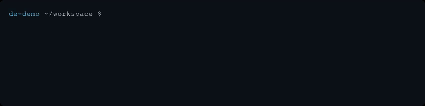

# de

`de` is a tiny inline directory explorer for your shell. It shows the current
directory, lets you walk into or out of folders, and changes the shell's working
directory only when you confirm.



At normal terminal widths, the left pane is the directory you are currently
exploring and the right pane previews the highlighted destination. Below 58
columns, `de` collapses to a single pane instead of squeezing the listings.
Each pane shows local modification times when it is wide enough to keep the
entry names readable.

It is intentionally not a file manager. Files are dimmed context; there are no
delete, rename, copy, edit, or open commands.

## Install

Install from crates.io with Cargo (the package is named `de-cli`, but the
installed command is `de`):

```sh
cargo install de-cli --locked
```

Prebuilt archives for Linux and macOS on x86-64 and ARM64 are available from
[GitHub Releases](https://github.com/reyamira/de/releases). Each archive includes
`de`, this README, and the MIT license; SHA-256 checksums are published alongside
the archives. Extract the archive, then place `de` somewhere on your `PATH`.

Set up the shell function that allows `de` to change its parent shell's working
directory:

```sh
eval "$(command de init bash)" # use zsh here if appropriate
```

For fish:

```fish
command de init fish | source
```

Add the relevant initialization line to your shell profile to enable `de` in
future sessions.

## Build from source

```sh
cargo build --release
export PATH="$PWD/target/release:$PATH"
de
```

The generated shell function captures the directory printed by the executable
and asks the parent shell to `cd` there; a child process cannot change its parent
shell's directory directly.

## Themes

Run the interactive selector to preview the real picker with every built-in and
custom theme, then save the one you choose:

```sh
de theme
```

Use `Left`/`Right` or `Up`/`Down` to preview `auto`, `light`, `dark`, `mono`,
`ocean`, `forest`, `amber`, and `rose`. `Enter` saves the displayed theme;
`Escape` cancels without changing the saved choice. On Linux, settings live in
`$XDG_CONFIG_HOME/de/config.toml`, or `~/.config/de/config.toml` when
`XDG_CONFIG_HOME` is unset.

For a one-time override, use `de --theme dark`. `DE_THEME=mono de` provides an
environment-level override. Precedence is command-line flag, environment,
saved choice, then `auto`.

The `auto` theme uses the terminal's default foreground and background, its
ANSI palette, and reverse video for selection. That adapts without trying to
guess the background color or waiting for a terminal query.

Create an editable custom theme with:

```sh
de theme create midnight
```

That adds a complete starting palette to `config.toml` without replacing other
settings or comments:

```toml
[theme]
selected = "midnight"

[themes.midnight]
extends = "dark"
accent = "#7dd3fc"
text = "default"
muted = "#94a3b8"
title = "#c4b5fd"
error = "#fb7185"
symlink = "#f0abfc"
selection_fg = "#0f172a"
selection_bg = "#67e8f9"
reverse_selection = false
dim_muted = false
```

Every field after `extends` is optional. A custom theme can extend any built-in
theme and override only what it needs. Colors accept `#RRGGBB`, `default`, or
ANSI names such as `blue`, `light-cyan`, and `dark-gray`. After editing, run
`de theme` to preview it alongside the built-ins. Custom names also work with
`--theme` and `DE_THEME`.

## Date and time

Modification timestamps use local time in `YYYY-MM-DD HH:MM` form by default.
Change their presentation in the same `config.toml` file:

```toml
[display]
modified = true
date_format = "iso"
time_format = "24h"
timezone = "local"
```

`date_format` accepts `iso`, `us`, `european`, `relative`, or `custom`:

| Setting | Example |
| --- | --- |
| `iso` | `2026-08-25 15:02` |
| `us` with `time_format = "12h"` | `08/25/26 03:02 PM` |
| `european` | `25/08/26 15:02` |
| `relative` | `4 min ago`, `yesterday`, `3 months ago` |

`time_format` accepts `12h` or `24h`, and `timezone` accepts `local` or `utc`.
Set `modified = false` to hide the column entirely. Sorting by modification time
still uses the exact filesystem timestamp regardless of its presentation.

For complete control, use a
[Chrono strftime format](https://docs.rs/chrono/latest/chrono/format/strftime/):

```toml
[display]
date_format = "custom"
custom_format = "%b %e, %Y at %l:%M %p"
timezone = "local"
```

Custom formats replace both the date and time presets; relative timestamps do
not use the clock or timezone settings. Column width follows the rendered values
automatically. When the terminal is too narrow to retain a readable filename
column, timestamps collapse away with the rest of the responsive layout.

## Controls

| Key | Action |
| --- | --- |
| `Up` / `Down`, `j` / `k` | Select an entry |
| `PageUp` / `PageDown` | Jump one visible page through the entries |
| `Right`, `l`, `Tab` | Make the previewed directory current |
| `Left`, `h`, `Backspace` | Go to the parent directory |
| `/` | Filter entries in the current directory |
| `s` | Toggle sorting by name or modification time |
| `Shift+S` | Toggle ascending or descending order |
| `Enter` | Change to the directory currently displayed |
| `.` | Toggle hidden entries |
| `r` | Refresh |
| `Escape`, `q`, `Ctrl-C` | Cancel without changing directory |

The important distinction is that `Enter` accepts the directory in the header,
not the highlighted child. Use `Right` to explore and `Enter` when you have
arrived.

Filtering uses a case-insensitive substring match. Type after pressing `/`, use
the normal arrow and page keys to move through matches, and press `Backspace` to
edit the query. `Escape` clears an active filter first; press it again to cancel
`de`.

Name sorting is case-insensitive and alphabetical. Sort criterion and direction
are independent, so modification time can show either oldest or newest first.
Directories remain grouped above files in every mode, and the selected sort
carries into the preview pane and navigated directories.

## Built with

- [Ratatui](https://ratatui.rs/) renders the interactive panes and layout.
- [Crossterm](https://github.com/crossterm-rs/crossterm) handles terminal input,
  raw mode, cursor movement, and colors.
- [Clap](https://docs.rs/clap/) parses arguments and generates the styled help,
  version, subcommand, and error output.
- [toml_edit](https://docs.rs/toml_edit/) reads and updates configuration while
  retaining the user's formatting and comments.

The small relative-coordinate backend in `src/backend.rs` keeps the picker
inline without requiring the terminal to answer an absolute cursor-position
query. This is useful in PTYs and layered terminal environments.

## Development

```sh
cargo fmt --check
cargo clippy --all-targets --all-features -- -D warnings
cargo test
```

The README demo is driven by the checked-in Terminal Control tape. To replay it
after building the release binary:

```sh
cargo build --release
termctrl play demo/de.tape
```

The tape creates and removes its own synthetic fixture under `/tmp`; its private
`.termctrl` timeline and intermediate MP4 are gitignored. `demo/de.gif` is the
small public artifact embedded above.

The UI is rendered on stderr so stdout remains a clean selected-path protocol
for the shell wrapper. On Unix, path bytes are preserved by the executable; like
most command-substitution integrations, directories whose names end in newline
characters are outside the supported shell-wrapper boundary.
